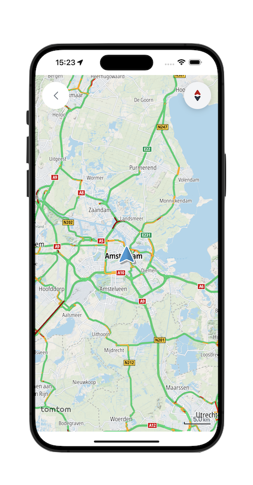
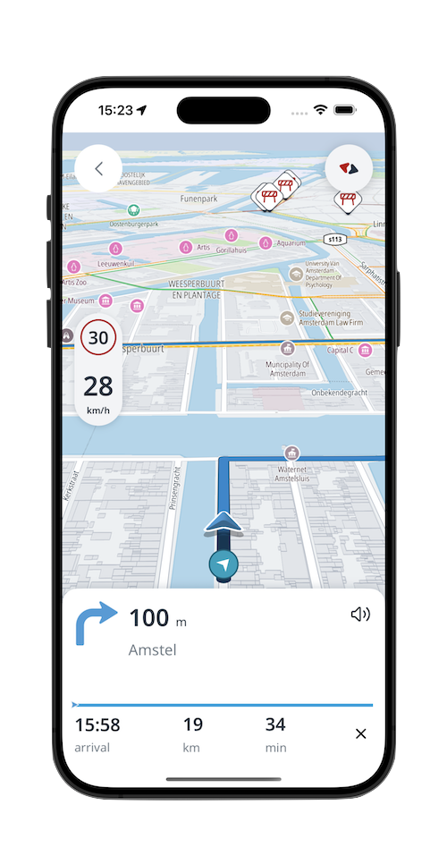

# TomTom Navigation SDK examples

This repository contains a set of individual Xcode projects showcasing features for TomTom Navigation SDK for
iOS.

For more information,
please [read the documentation](https://developer.tomtom.com/ios/navigation/documentation/overview/introduction).

💻 Requirements
------------
> **Note**  TomTom Navigation SDK for iOS is only available upon
> request. [Contact us](https://developer.tomtom.com/tomtom-sdk-for-ios/request-access "Contact us") to get access.

Once you have obtained access, do the following:

* Install Xcode 13 or 14.
* Set the deployment target to at least 13.0.

## Cloning the repository
Clone the repository `https://github.com/tomtom-international/tomtom-navigation-ios-examples.git`

🚀 Examples
------------

|Project|||
|-|-|-|
|<b>tomtom-navigation-core-examples</b>  A collection of examples showcasing online use cases, including a basic driving application that displays a map, shows the user’s location, calculates and displays routes, and enables turn-by-turn navigation using built-in UI components.   **[> Browse](tomtom-navigation-core-examples/)**|</img>|</img>|