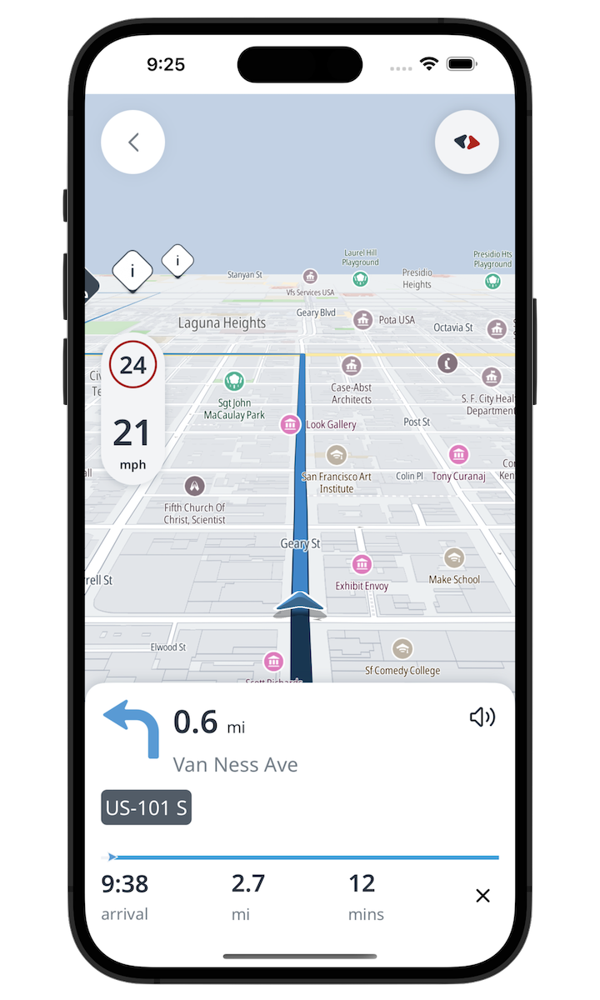

# TomTom Navigation iOS SDK Examples

Hello and welcome to this repository with examples showcasing the [TomTom Navigation SDK for iOS].

> **Note** Navigation SDK for iOS is only available upon request. In order to get access, [contact us].

<div align="center">
  
</div>

## Development setup

Once you have gained access, set up the development environment by following:

1. Install Xcode if you don't already have it. Supported versions of Xcode are 13 to 14, inclusive.

2. We recommend using `rbenv` to handle `ruby` selection/installation.
   1. Install `rbenv`
   ```zsh
   brew install rbenv
   ```
   2. Clone the [tomtom-navigation-ios-examples] repository
   ```zsh
   git clone https://github.com/tomtom-international/tomtom-navigation-ios-examples.git
   ```   
   3. Change directory to the recently cloned repository and install `ruby` via `rbenv`
   ```zsh
   cd tomtom-navigation-ios-examples
   rbenv install
   ```
   4. Load `rbenv` to your shell
   ```zsh
   echo 'eval "$(rbenv init - zsh)"' >> ~/.zshrc
   ```
   Above command assumes that `zsh` is being used. If a different shell is being used, then you can find 
   commands for most common shells in [rbenv documentation].

   5. Update `bundler`
   ```zsh
   gem install bundler
   ```
   6. Ensure you ***reload*** your shell so the `rbenv` can extend `PATH` accordingly.

3. Install project's `gem` dependencies via `bundler`
   ```zsh
   bundle install
   ```

4. Add a reference to the [Cocoapods] private repository:
   ```zsh
   bundle exec pod repo-art add tomtom-sdk-cocoapods "https://repositories.tomtom.com/artifactory/api/pods/cocoapods"
   ```

5. Install the dependencies by executing the following command in **the project folder**.
    ```
    bundle exec pod install
    ```

6. To update the SDK version, run the command:
    ```
    bundle exec pod repo-art update tomtom-sdk-cocoapods
    ```
7. Open the project’s `xcworkspace` and start developing your awesome application.

## API Keys

In order to manage, create or delete your API keys, you need to have a [TomTom Developer Portal] account.
If you don't have one, you need to [register] for one.
Follow the steps from [How to get a TomTom API Key] to learn how to create an API key.

> **Note** Using an invalid API key will cause issues loading the map or running navigation.

In order to insert your API key in the project, you need to change the `Keys.swift` file.

```swift
enum Keys {
    static let apiKey = "YOUR_API_KEY"
}
```

## Troubleshooting

If you have a **black screen** when launching the Basic driving app, please follow the steps below.

- Check that you have updated the `API key` with yours in the `Keys.swift` file.
- Check that your `API key` is valid for the requested features
- Check your internet connection

---

[Cocoapods]: (https://guides.cocoapods.org/using/getting-started.html)
[contact us]: https://developer.tomtom.com/tomtom-sdk-for-ios/request-access
[How to get a TomTom API Key]: https://developer.tomtom.com/how-to-get-tomtom-api-key
[rbenv documentation]: https://github.com/rbenv/rbenv#readme
[register]: https://developer.tomtom.com/user/register
[tomtom-navigation-ios-examples]: https://github.com/tomtom-international/tomtom-navigation-ios-examples
[TomTom Navigation SDK for iOS]: https://developer.tomtom.com/ios/navigation/documentation/overview/introduction
[TomTom Developer Portal]: https://developer.tomtom.com/user/me/apps