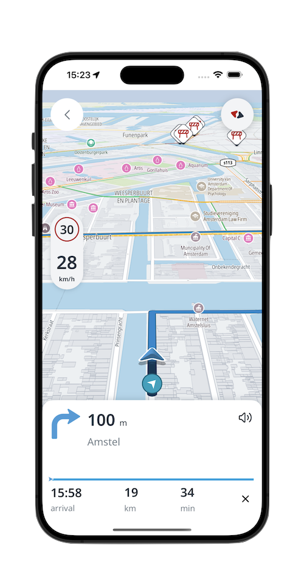
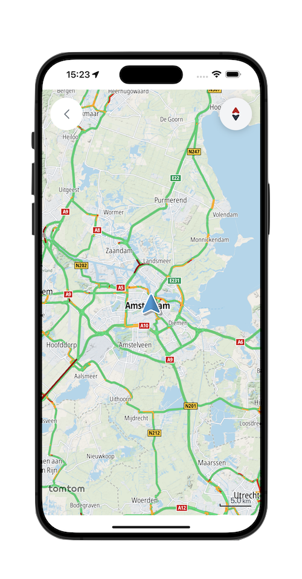

# Online navigation app using TomTom SDK

This project is a sample app to show how to run online modules using the TomTom Navigation SDK on iOS.

- [TomTom Navigation SDK for iOS].

> **Note:** It's not a complete app that includes all TomTom Navigation SDK functionalities and implementations.

<div align="center">
  
</div>

## Features

- Show the map and the user location
- Long press on the map to start a navigation
- Navigation view
    - Next instruction view
    - Route line progress view
    - Estimated time of arrival (ETA) view
    - Lane guidance view
    - Combined instruction view
    - Route updated view

## Setup

> **Note** TomTom Navigation SDK for iOS is only available upon
> request. [Contact us] to get access.

Once you have obtained access, do the following:

### API Keys

In order to manage, create or delete your API keys, you need to have a [TomTom Developer Portal] account.
If you don't have one, you need to [register] for one.
Follow the steps from [How to get a TomTom API Key] to learn how to create an API key.

> **Note** Using an invalid API key will cause issues loading the map or running navigation.

In order to insert your API key in the project, you need to change the `Keys.swift` file.

```swift
enum Keys {
    static let apiKey = "YOUR_API_KEY"
}
```

### Package Manager

SPM or CocoaPods can be used to install the Navigation SDK. Both configurations are available in the examples. Please navigate to the related directory and find the project setup configuration.
- [Project setup for SPM]
- [Project setup for CocoaPods]

### Running the app

- The first time you launch the app you will be prompted to allow the app access to your location. Choose "Always While Using App".
- The globe and map will swiftly appear, with your current location marker appearing after a brief moment. Center the
  map on your location by tapping the current location button.
- To calculate a route and initiate navigation, perform a long click on the map.

## Preview

You can see the downloaded map when the downloading process finished as below.

|Map|Navigation|
|-|-|
|  | |

## Subdirectories
- [Link to Use Case README]

[TomTom Navigation SDK for iOS]: https://developer.tomtom.com/ios/navigation/documentation/overview/introduction
[TomTom Developer Portal]: https://developer.tomtom.com/user/me/apps
[How to get a TomTom API Key]: https://developer.tomtom.com/how-to-get-tomtom-api-key
[register]: https://developer.tomtom.com/user/register
[Contact us]: https://developer.tomtom.com/tomtom-sdk-for-ios/request-access
[Project setup for SPM]: SPM
[Project setup for CocoaPods]: CocoaPods
[Link to Use Case README]: TomTomSDKExamples/Examples/UseCase/README.md