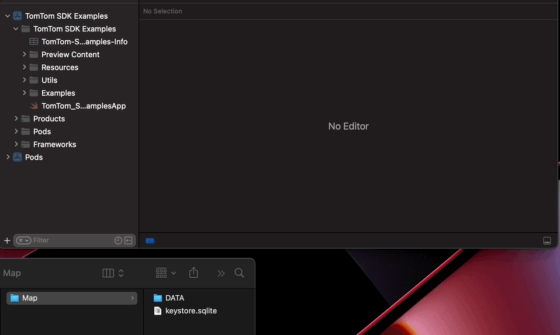

# Simple navigation app using TomTom SDK

*Note: Navigation SDK for iOS is only available upon request. [Contact us](https://developer.tomtom.com/tomtom-sdk-for-ios/request-access "Contact us") to get started.*

*Note: If you have not set up your development environment, please refer to the [Development Setup](../../../README.md) page.*

## Online Map Example

This example shows how to build a simple navigation application using the TomTom Navigation SDK for iOS.
The application displays a map and shows the user’s location. After the user selects a destination with a long press, the app plans a route and draws it on the map. Navigation is started automatically using the route simulation. 

For further explanations on the example provided can be found in this [tutorial](https://developer.tomtom.com/ios/navigation/documentation/use-cases/build-a-navigation-app).

## Offline Map Example

The offline map example shows how to use offline maps using the TomTom Navigation SDK for iOS.

Upon receiving the offline maps data and the map license from TomTom, it is necessary to copy the offline maps directory into the project's root folder and name it "Map" following the directory structure provided below and change the map license in the `Keys.swift` file.

- Map
    - DATA
    - keystore.sqlite

*Note: This example uses an online route planner.*